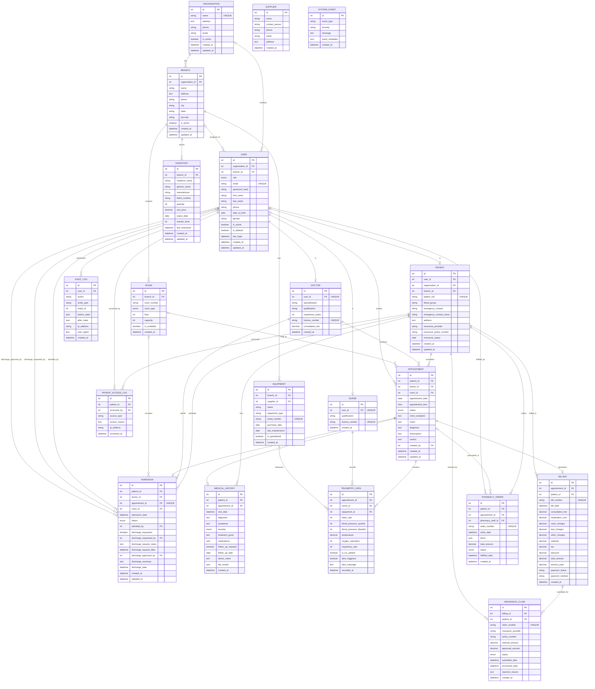

```mermaid
erDiagram

    ORGANIZATION {
        int id PK
        string name "UNIQUE"
        text address
        string phone
        string email
        boolean is_active
        datetime created_at
        datetime updated_at
    }

    BRANCH {
        int id PK
        int organization_id FK
        string name
        text address
        string phone
        string city
        string state
        string pincode
        boolean is_active
        datetime created_at
        datetime updated_at
    }

    USER {
        int id PK
        int organization_id FK
        int branch_id FK
        enum role
        string email "UNIQUE"
        string password_hash
        string first_name
        string last_name
        string phone
        date date_of_birth
        string gender
        boolean is_active
        boolean is_deleted
        datetime last_login
        datetime created_at
        datetime updated_at
    }

    PATIENT {
        int id PK
        int user_id FK
        int organization_id FK
        int branch_id FK
        string patient_uid "UNIQUE"
        string blood_group
        string emergency_contact
        string emergency_contact_name
        text address
        string insurance_provider
        string insurance_policy_number
        date insurance_expiry
        datetime created_at
        datetime updated_at
    }

    DOCTOR {
        int id PK
        int user_id FK "UNIQUE"
        string specialization
        string qualification
        int experience_years
        string license_number "UNIQUE"
        decimal consultation_fee
        datetime created_at
    }

    NURSE {
        int id PK
        int user_id FK "UNIQUE"
        string qualification
        string license_number "UNIQUE"
        datetime created_at
    }

    ROOM {
        int id PK
        int branch_id FK
        string room_number
        enum room_type
        int floor
        int capacity
        boolean is_available
        datetime created_at
    }

    EQUIPMENT {
        int id PK
        int branch_id FK
        int supplier_id FK
        string name
        string equipment_type
        string serial_number "UNIQUE"
        date purchase_date
        date last_maintenance
        boolean is_operational
        datetime created_at
    }

    APPOINTMENT {
        int id PK
        int patient_id FK
        int doctor_id FK
        int room_id FK
        date appointment_date
        time appointment_time
        enum status
        text chief_complaint
        text notes
        text diagnosis
        text prescription
        text verdict
        int created_by FK
        datetime created_at
        datetime updated_at
    }

    ADMISSION {
        int id PK
        int patient_id FK
        int doctor_id FK
        int appointment_id FK "UNIQUE"
        int room_id FK
        datetime admission_date
        enum status
        int admitted_by FK
        boolean discharge_requested
        int discharge_requested_by FK
        text discharge_request_notes
        datetime discharge_request_date
        int discharge_approved_by FK
        text discharge_summary
        datetime discharge_date
        datetime created_at
        datetime updated_at
    }

    MEDICAL_HISTORY {
        int id PK
        int patient_id FK
        int appointment_id FK
        datetime visit_date
        text diagnosis
        text symptoms
        enum severity
        text treatment_given
        json medications
        boolean follow_up_required
        date follow_up_date
        text doctor_notes
        json lab_results
        datetime created_at
    }

    TELEMETRY_DATA {
        int id PK
        int appointment_id FK
        int nurse_id FK
        int equipment_id FK
        int heart_rate
        int blood_pressure_systolic
        int blood_pressure_diastolic
        decimal temperature
        int oxygen_saturation
        int respiratory_rate
        boolean is_icu_patient
        boolean alert_triggered
        text alert_message
        datetime recorded_at
    }

    BILLING {
        int id PK
        int appointment_id FK
        int patient_id FK
        string bill_number "UNIQUE"
        datetime bill_date
        decimal consultation_fee
        decimal medication_cost
        decimal room_charges
        decimal test_charges
        decimal other_charges
        decimal subtotal
        decimal tax
        decimal discount
        decimal total_amount
        decimal amount_paid
        string payment_status
        string payment_method
        datetime created_at
    }

    INSURANCE_CLAIM {
        int id PK
        int billing_id FK
        int patient_id FK
        string claim_number "UNIQUE"
        string insurance_provider
        string policy_number
        decimal claimed_amount
        decimal approved_amount
        enum status
        datetime submitted_date
        datetime processed_date
        text rejection_reason
        datetime created_at
    }

    SUPPLIER {
        int id PK
        string name
        string contact_person
        string phone
        string email
        text address
        datetime created_at
    }

    INVENTORY {
        int id PK
        int branch_id FK
        string medicine_name
        string generic_name
        string manufacturer
        string batch_number
        int quantity
        decimal unit_price
        date expiry_date
        int reorder_level
        datetime last_restocked
        datetime created_at
        datetime updated_at
    }

    PHARMACY_ORDER {
        int id PK
        int patient_id FK
        int appointment_id FK
        int pharmacy_staff_id FK
        string order_number "UNIQUE"
        datetime order_date
        json items
        decimal total_amount
        enum status
        datetime fulfilled_date
        datetime created_at
    }

    PATIENT_ACCESS_LOG {
        int id PK
        int patient_id FK
        int accessed_by FK
        string access_type
        text access_reason
        string ip_address
        datetime accessed_at
    }

    AUDIT_LOG {
        int id PK
        int user_id FK
        string action
        string entity_type
        int entity_id
        json before_state
        json after_state
        string ip_address
        text user_agent
        datetime created_at
    }

    SYSTEM_EVENT {
        int id PK
        string event_type
        string severity
        text message
        json event_metadata
        datetime created_at
    }

    %% Core Hierarchy
    ORGANIZATION ||--o{ BRANCH : "has"
    ORGANIZATION |o--o{ USER : "employs"
    BRANCH |o--o{ USER : "assigned_to"
    
    %% User Role Extensions
    USER ||--o| PATIENT : "is"
    USER ||--o| DOCTOR : "is"
    USER ||--o| NURSE : "is"
    
    %% Branch Resources
    BRANCH ||--o{ ROOM : "contains"
    BRANCH ||--o{ EQUIPMENT : "has"
    BRANCH ||--o{ INVENTORY : "stocks"
    
    %% Patient Care Flow
    PATIENT ||--o{ APPOINTMENT : "schedules"
    DOCTOR ||--o{ APPOINTMENT : "conducts"
    ROOM |o--o{ APPOINTMENT : "held_in"
    USER |o--o{ APPOINTMENT : "creates"
    
    %% Admissions
    PATIENT ||--o{ ADMISSION : "admitted"
    DOCTOR ||--o{ ADMISSION : "admits"
    APPOINTMENT ||--o| ADMISSION : "leads_to"
    ROOM |o--o{ ADMISSION : "occupies"
    USER |o--o{ ADMISSION : "admitted_by"
    USER |o--o{ ADMISSION : "discharge_requested_by"
    USER |o--o{ ADMISSION : "discharge_approved_by"
    
    %% Medical Records
    PATIENT ||--o{ MEDICAL_HISTORY : "has"
    APPOINTMENT ||--o| MEDICAL_HISTORY : "documented_in"
    
    %% Telemetry
    APPOINTMENT ||--o{ TELEMETRY_DATA : "monitors"
    NURSE ||--o{ TELEMETRY_DATA : "records"
    EQUIPMENT |o--o{ TELEMETRY_DATA : "measures"
    
    %% Financial
    APPOINTMENT ||--o| BILLING : "generates"
    PATIENT ||--o{ BILLING : "billed_to"
    BILLING ||--o{ INSURANCE_CLAIM : "submitted_for"
    PATIENT ||--o{ INSURANCE_CLAIM : "claimed_by"
    
    %% Pharmacy
    PATIENT ||--o{ PHARMACY_ORDER : "orders"
    APPOINTMENT |o--o{ PHARMACY_ORDER : "prescribed_in"
    USER |o--o{ PHARMACY_ORDER : "fulfilled_by"
    
    %% Audit & Compliance
    PATIENT ||--o{ PATIENT_ACCESS_LOG : "accessed"
    USER ||--o{ PATIENT_ACCESS_LOG : "accessed_by"
    USER |o--o{ AUDIT_LOG : "performed"
```